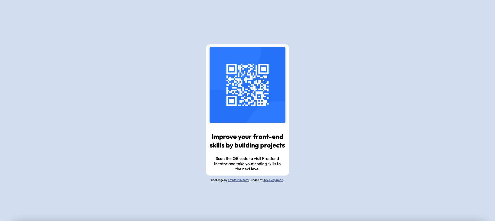

# Frontend Mentor - QR code component solution

This is a solution to the [QR code component challenge on Frontend Mentor](https://www.frontendmentor.io/challenges/qr-code-component-iux_sIO_H). Frontend Mentor challenges help you improve your coding skills by building realistic projects. 

## Table of contents

- [Overview](#overview)
  - [Screenshot](#screenshot)
  - [Links](#links)
- [My process](#my-process)
  - [Built with](#built-with)
  - [What I learned](#what-i-learned)
  - [Continued development](#continued-development)
  - [Useful resources](#useful-resources)
- [Author](#author)
- [Acknowledgments](#acknowledgments)

## Overview

### Screenshot
Desktop :


Mobile : 


### Links

- Solution URL: [Add solution URL here](https://your-solution-url.com)
- Live Site URL: [Add live site URL here](https://your-live-site-url.com)

## My process

### Built with
- HTML5
- CSS3
- Semantic HTML5 markup
- CSS3 custom properties
- CSS3 Flexbox

### What I learned

Using auto margin to position elements to the center of a webpage: 

```css
.container {
  margin: 0 auto;
}
```

### Continued development

Continuing to learn how to properly position elements in HTML/CSS. 

### Useful resources

- [w3schools.com](https://www.w3schools.com/) - One of the main resources that I use for learning how to position elements in CSS. 
- [youtube.com](https://www.youtube.com/) - Utilizing youtube to visually see how certain properties work when implemented and get a better understanding how things work.

## Author

- GitHub - [Kyle Deguzman (CSE-Kyle)](https://github.com/CSE-Kyle)
- Frontend Mentor - [@CSE-Kyle](https://github.com/CSE-Kyle)
- Netlify - [@CSE-Kyle](https://app.netlify.com/teams/cse-kyle/overview)

## Acknowledgments

Frontend Mentor Discord Community 🙌🏼 